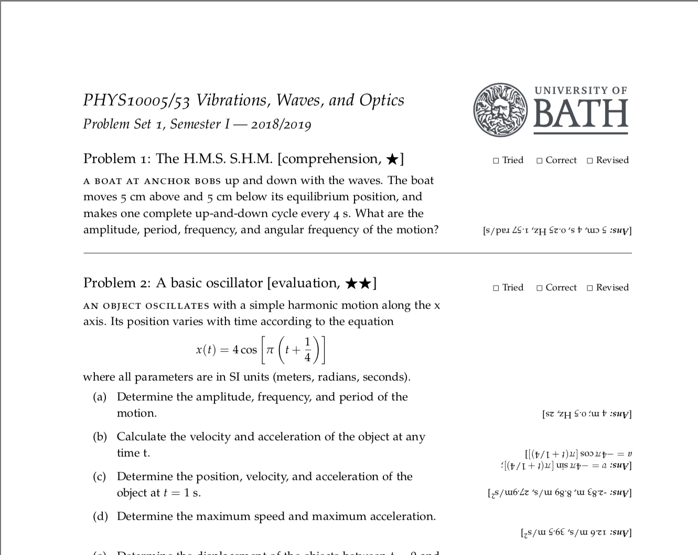
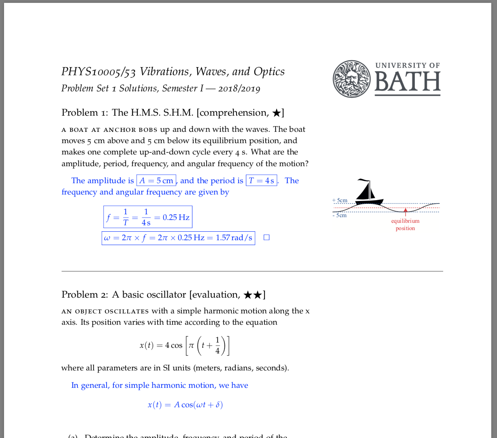

# TsangPS

# Tsang Problem Set Class/Style TsangPS v 1.0
18/08/22 - D.Tsang@soton.ac.uk

Built on the tufte-handout class

Using TsangPS.cls and TsangPS.sty
you can call the document class

\documentclass{TsangPS}

# Samples

# Class Options:

	solutions : shows full worked solutions, no checkboxes,

	problemsheet : only the problems with revision checkboxes in margin, short answers are  shown in margin

	FlipAns : short answers for problem sheet are rotated by 180 degrees

Alternatively you can use definitions before \documentclass to set command line
multi-file options

	\def\problemsheet{}  in order to set problemsheet

	\def\flipanswer{} in order to set FlipAns

all standard tufte-handout options are also passable

# Class Commands:

	\unittitle{TITLE} - sets the unit title i.e. Vibrations, Waves, and Optics

	\unitcode{CODE} - sets the unit code i.e. PHYS10005/53

	\lecturer is not currently included, but could be

	\setnumber{NUMBER} sets the problem set number in the title/headings

	\logo[offset]{PATH} sets the path to the logo file to load next to the title
	you can use the offset in length units (cm, pts etc) in order
	to shift the image up or down 

	\semester{SEMESTER} sets the semester value, i.e. Semester I, 2018-2019

 	You can use the command \SetAnswerFlip{true} in order to change to 
 	upside down answers, or \SetAnswerFlip{false} in order to change back
	
	\makeline makes a thin horizontal line that (using \cleaders) that is not drawn if it occurs at 
	the beginning and end of the page

 # The question environment
 
 	\begin{question}{TITLE}{TYPE}{DIFFICULTY}{EXAM}
	
		...
		
		\solution{}{}
		
	\end{question}
	
Use Problem counter to label the problems, adds in checkmarks for Tried, Correct, Revised in margin next to problem
 title. Problem heading of the form:
 
 	Problem \theProblem: TITLE [type(TYPE), $\bigstar$...(, past exam)] 
	
where TYPE is 0-5 which specify:
	0 : evaluation
	
	1 : knowledge
	
	2 : comprehension
	
	3: application
	
	4: analysis
	
	5: synthesis
	
The Diffuclty is 1-3, which specifies the number of $\bigstar$ symbols to indicate difficulty

If the EXAM argument is set to 1, the past exam indicator will appear.

# Solutions

	\solution{FULL SOL}{SHORT ANS}

 Solutions have second argument printed [Ans: #2] upside down in the 
 margin of the problem sheet
 and #1 only shown in the solutions set.
 if no margin answers are wanted on the problem sheet just use an empty second arg

# Boxes 
 A TikZ box is available for long asides using
 
 
 
	 \begin{mybox}[width=WIDTH]{TITLE}
 
 	   ...
    
	 \end{mybox}

